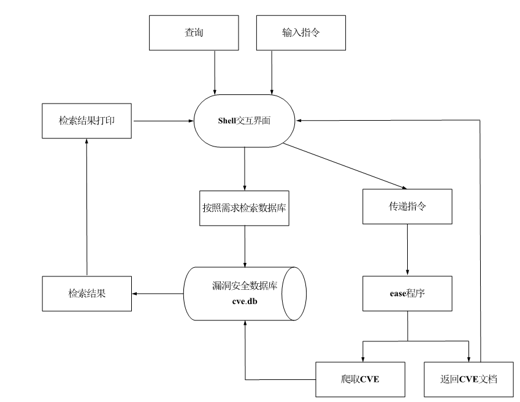

# CVE-ease设计

## 1.概述

CVE（通用漏洞披露）是关乎系统安全稳定的关键信息，因此对CVE信息的处理和管理就显得尤为重要。基于此，开发CVE-ease的CVE漏洞管理系统，以实现漏洞信息实时获取、管理和播报。

## 2.主要功能

CVE-ease主要有以下功能：

* CVE信息获取和分析
* CVE信息整理和存放
* 历史CVE和实时CVE信息查看
* CVE状态实时跟踪
* CVE动态信息实时播报

  ​                  

## 3.模块功能

|   **主模块**   |                                                 |
| :------------: | ----------------------------------------------- |
|    模块名称    | 功能简述                                        |
|    CVE获取     | 抓取CVE信息，实时更新CVE信息，并放入CVE数据库。 |
|  管理文档生成  | 从数据库拉取CVE信息生成排查文档和总体文档。     |
|  实时播报模块  | 定时播报当前CVE，实时播报新出现的CVE            |
|    交互界面    | 实现CVE查询和用户交互功能。                     |
| **支撑类模块** |                                                 |
|    模块名称    | 功能简述                                        |
| 漏洞安全数据库 | 存放整合后的CVE安全漏洞信息。                   |

### 3.1 CVE获取

当CVE-ease运行时，系统会按照特定时间间隔从CVE披露网站抓取CVE信息。抓取CVE信息前，需要对CVE数据库进行扫描。建立已有CVE编号的索引，并测试系统和各CVE平台是否连通。抓取过程中，首先抓取最新披露的CVE信息编号，再根据CVE编号抓取CVE描述等具体信息，如果信息正常抓取到，流程结束。否则重新执行抓取，直到抓取到。

### 3.2 CVE信息整理和存放

抓取到的CVE需要进行整理，按照特定的数据结构放入数据库，并计算特征值。如果爬取到的CVE编号不存在于数据库中，则直接放入漏洞数据库，如果存在，则对比特征值是否一致，不一致则根据差异对该条CVE内容进行更新。

### 3.3 历史CVE和实时CVE信息查看

在用户交互界面，可以通过交互指令查询特定的CVE信息。默认展示的是最新的前10条CVE信息，也可通过修改指令选项来查询特定范围的历史CVE信息（CVE分数，年份等）。

